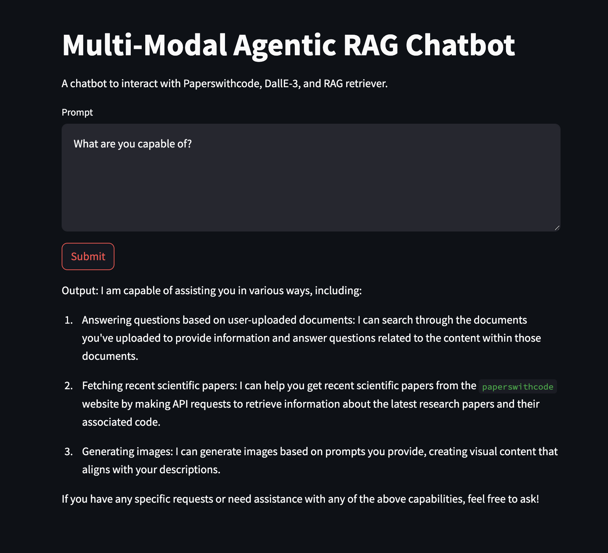
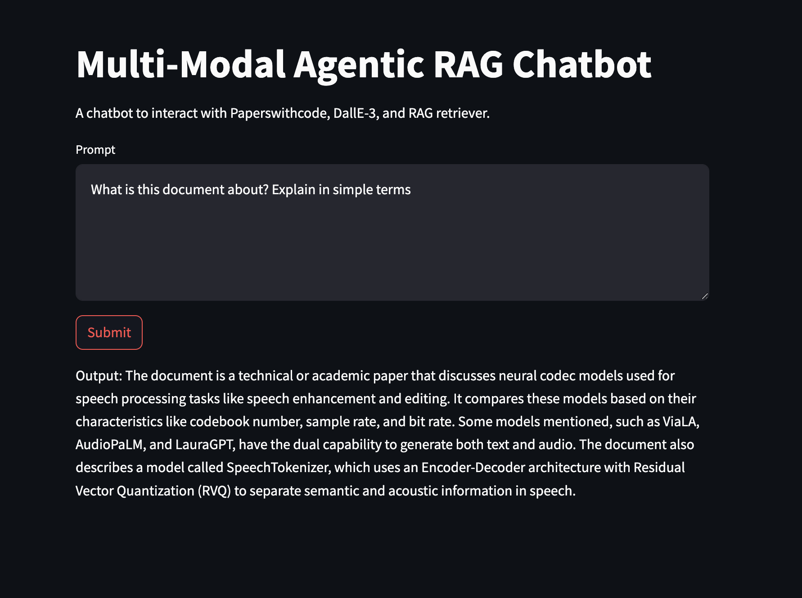
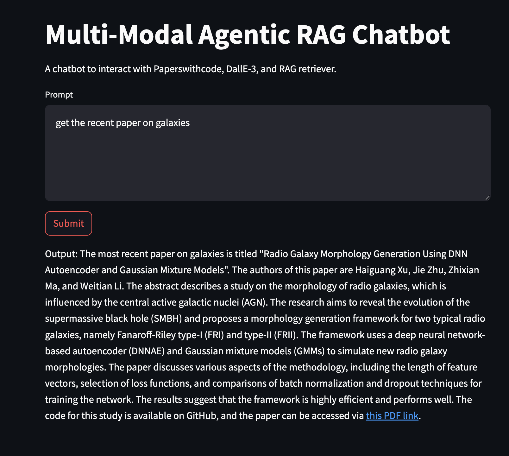
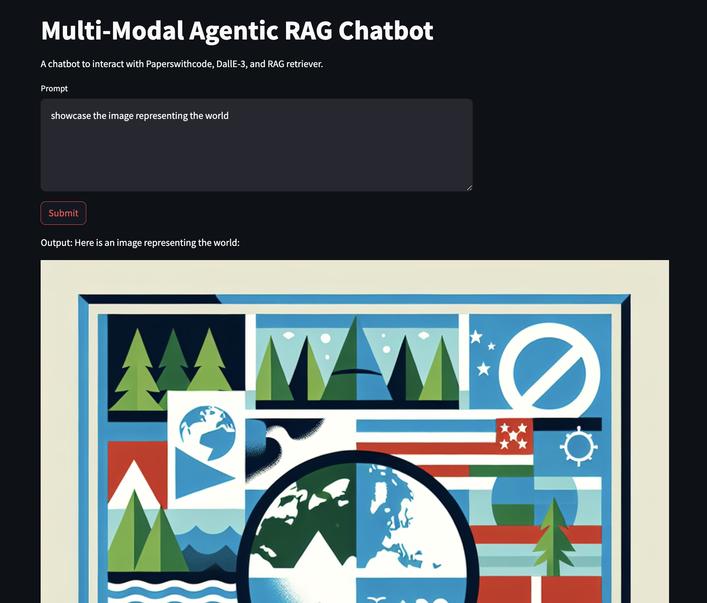

# Multi-Modal LangChain Chatbot

A Multi-Modal Chatbot with LangChain that also supports the agentic RAG

The ChatBot supports:

1. Chat with your documents using basic RAG
2. Query "Paperswithcode" site to get a gist of recent papers on any topic
3. Generate images using DallE-3

The code base has been organized into the following folders:

1. `docs`: Store your PDF documents in this folder
2. `services`: Add all your agent-specific services here
3. `tools`: Create a tool for your services

The `main.py` consists of the actual System Prompt and the registration of the tools.
Make sure to register your new tools here. The UI can be created using both, Gradio, and Streamlit.

Note: When using image generation, I was finding it difficult to represent images in Gradio, hence I went with Streamlit at the end. But feel free to play around.

# How to run:

1. `pip install -r requirements.txt` to install all the libraries
2. From your terminal run, `export OPENAI_API_KEY=sk-xxxx`
3. Store your PDFs in the `docs` folder
4. If using Gradio, `python3 main.py`
5. If using Streamlit, `streamlit run main.py`
6. Once you start the app, a `chroma_persists` folder will be created along with a `logs` folder

### Improvements:

1. This is a basic RAG, one can create CRAG, Rank based RAG, etc
2. Showcase Chat History (currently, not showing it)
3. Add more agents specific to your needs (don't forget to register it in `main.py`)
4. Use the `config` file to store model details, etc that are needed for RAG as well as other agents

# Sample Output:

1. 

2. 

3. 

4. 
